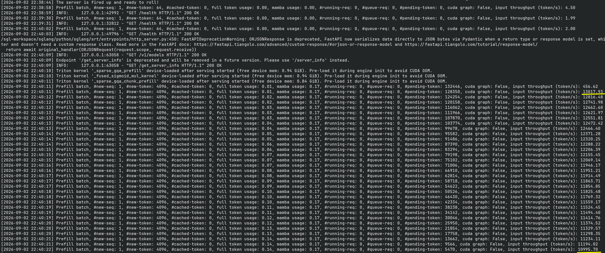
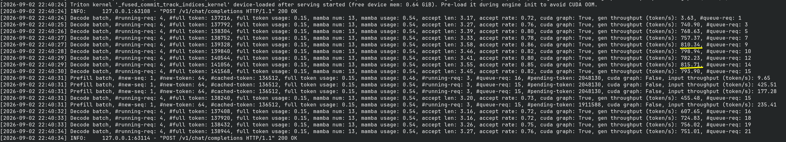
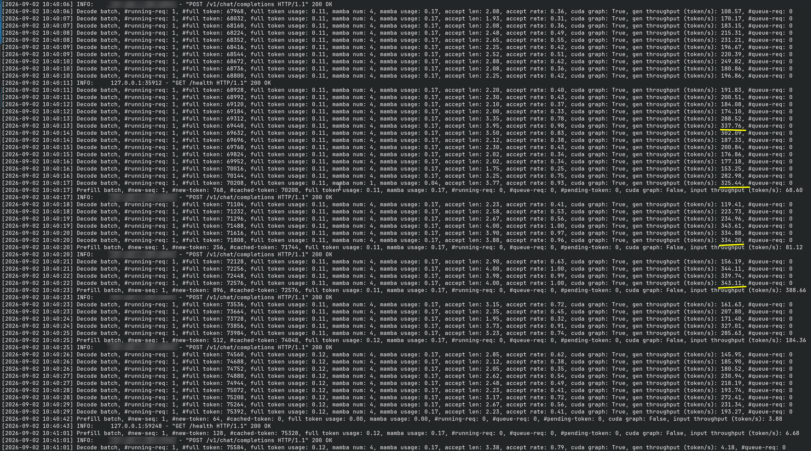
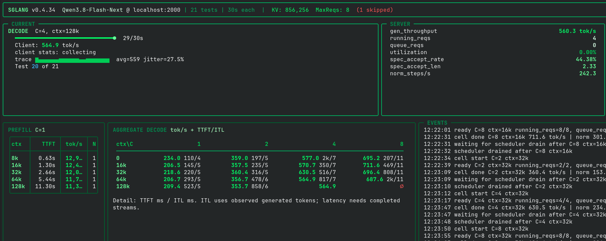

# sglang-qwen38fn-sm120-turbo

Serving stack for **Qwen3.8-Flash-Next** on 96 GiB VRAM (1x RTX Pro 6000, might also work on DGX Spark):
- https://qwen.ai/blog?id=qwen3.8-flash-next
- https://huggingface.co/Qwen/Qwen3.8-Flash-Next
- https://github.com/QwenLM/Qwen3.8-Flash-Next/blob/main/tech_report.pdf

Qwen3.8-Flash-Next is a highly performant LLM that serves as a preview for the future Qwen4 family.
Despite being undertrained, and having very few active parameters and a small size (125B + 6B active + 51B of offloadable embedding table), benchmarks show performance comparable to closed-source LLMs from just 3 months ago (e.g. Opus 4.8).

## Numbers

On the NVFP4 checkpoint [`RadixArk/Qwen3.8-Flash-Next-NVFP4`](https://huggingface.co/RadixArk/Qwen3.8-Flash-Next-NVFP4), served by the day-0 SGLang image:
- 1x RTX Pro 6000, power-limited to 360W, memory overclocked by +3000MT/s (+6000 in LACT)
- 939456 tokens in KV cache
- Default 4 max concurrent requests (more requires more linear attention cache which directly eats into KV cache)
- 11k~13k prefill tok/s

  <details><summary>prefill trace</summary>

  

  </details>
- 800 decode tok/s (~200 tok/s per stream) on hard-to-predict `--profile estonia` reasoning benchmark from https://github.com/local-inference-lab/llm-inference-bench

  <details><summary>decode trace, 4 concurrent requests</summary>

  

  </details>
- up to 340 decode tok/s single request on easy to predict code/compaction

  <details><summary>decode trace, single request</summary>

  

  </details>
- 177~211 tok/s single request on hard to predict concurrency benchmark from https://github.com/local-inference-lab/llm-inference-bench



## Behind-the-scenes

This builds on top of the day-0 official Docker image `lmsysorg/sglang:qwen38flashnext`:

- **0001** makes fp8 KV cache work on sm_120.
- **0002** linear-attention layers don't cache MTP drafts, they are recomputed. Saves ~2 GB of KV budget. (And it's surprisingly not slower)
- **0003** quantizes at load whatever the checkpoint left in bf16 (attention, MLP, lm_head, hyperconnection mix) to MXFP8 to reduce memory bandwidth at close to zero-accuracy cost. On FlashInfer 0.6.18, this should be even faster as FlashInfer 0.6.18 integrates [`local-inference-lab/b12x`](https://github.com/local-inference-lab/b12x) and its hardware-accelerated block-scaled GEMM kernel.
- **0004** prepares support for https://huggingface.co/local-inference-lab/Qwen3.8-Flash-Next-NVFP4 which has a calibration dataset richer than CNN/DailyMail. This is important to get proper scales for NVFP4 activations so signal isn't lost due to oversaturation because the calibration scale doesn't represent actual maximum.

## Build and serve

Modify the top of `serve_sglang_qwen3.8-flash-next-example.sh` for your machine:
- `IMAGE`: tag you built below
- `CHECKPOINT`: `radixark` (validated) or `lil` (WIP)
- `MODEL_SOURCE`: `hf` (downloads to `HF_CACHE`) or `local` (reads `LOCAL_MODELS/<dir>` offline)
- `GPU_UTIL`, `MAX_RUNNING`, `HICACHE_SIZE`: KV fraction, concurrency, KVcache RAM offloading
- `PODNAME`, `SGLANG_PORT`: container name and port

```bash
podman build -t localhost/sglang-qwen38fn-sm120-turbo:r20 .
./serve_sglang_qwen3.8-flash-next-example.sh    # recap of the full config goes to stderr
curl -s localhost:30000/health
```

Keep your own variants in `internal/`: the folder ships empty and everything in it is git-ignored, so a customized launcher (`internal/serve_my.sh`, host paths, bench settings) lives beside the stack without ever being committed or published.

## Acknowledgements

While I choose different solutions, a significant amount of work has gone into both quant and tuning inference engines.

Thanks to:
- [SGLang](https://github.com/sgl-project/sglang) / [RadixArk](https://huggingface.co/RadixArk) for the day-0 image support ([`lmsysorg/sglang:qwen38flashnext`](https://hub.docker.com/r/lmsysorg/sglang)) and the [NVFP4 quant](https://huggingface.co/RadixArk/Qwen3.8-Flash-Next-NVFP4)
- local-inference-lab ([GitHub](https://github.com/local-inference-lab), [Hugging Face](https://huggingface.co/local-inference-lab), incl. the [NVFP4 release](https://huggingface.co/local-inference-lab/Qwen3.8-Flash-Next-NVFP4) and the [llm-inference-bench](https://github.com/local-inference-lab/llm-inference-bench) the Numbers section measures on), voipmonitor, lukealonso and the community for supporting RTX Pro 6000 development with kernels, docker images, quants and benchmark tooling.
- Other serving stacks for Qwen3.8-Flash-Next:
  - [jpezzulli/sglang-rtxpro6000](https://github.com/jpezzulli/sglang-rtxpro6000)
  - [gabrielolympie/sglang-flashnext-sm120](https://github.com/gabrielolympie/sglang-flashnext-sm120)
  - [lovedheart/sglang](https://github.com/lovedheart/sglang) and their [NVFP4-FP8 checkpoint](https://huggingface.co/lovedheart/Qwen3.8-Flash-Next-NVFP4-FP8)
  - [ormandj/sglang-qwen38-flash-next-sm120](https://github.com/ormandj/sglang-qwen38-flash-next-sm120)
  - [yepapa-nest/qwen38-flashnext-rtx6000](https://github.com/yepapa-nest/qwen38-flashnext-rtx6000)

## License

SGLang and the patches are under the Apache-2.0 License.

The SGLang docker image builds on top of NVIDIA's Ubuntu+CUDA image, which is under the NVIDIA Deep Learning Container License.